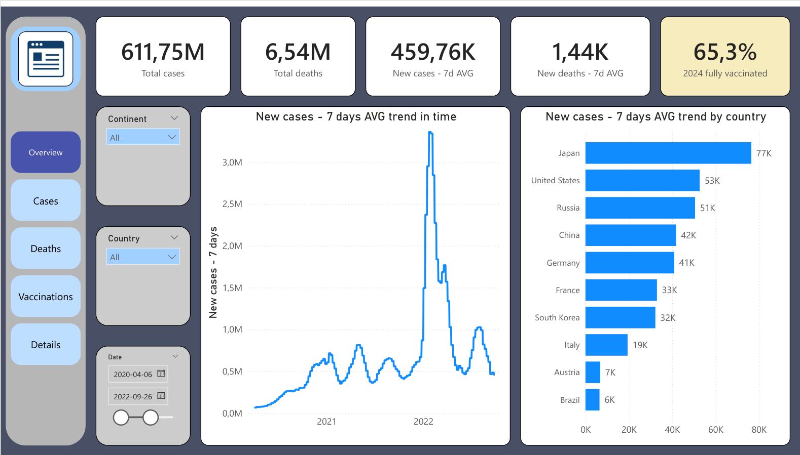
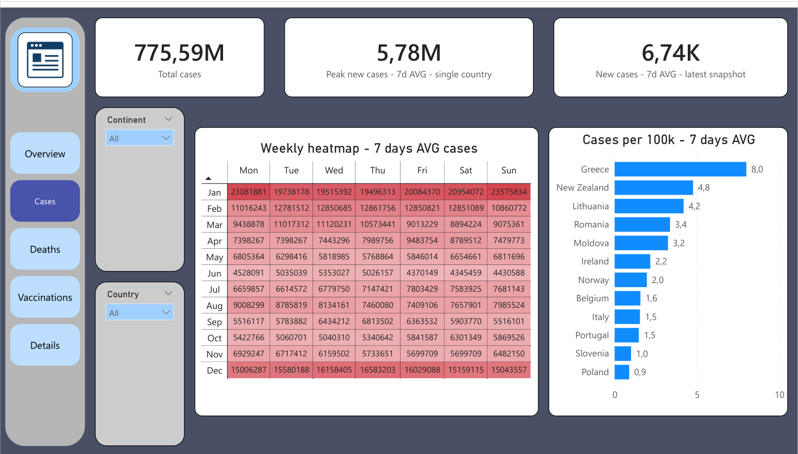
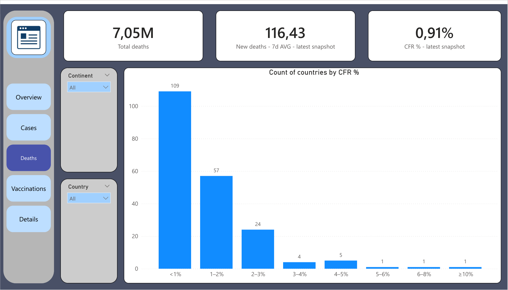
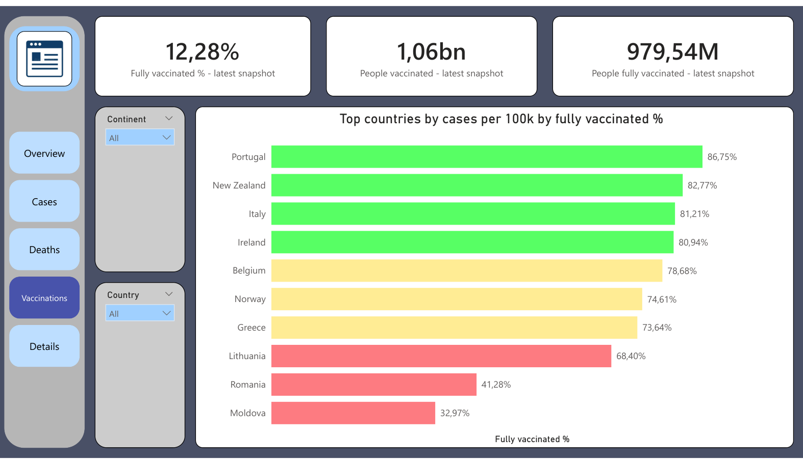
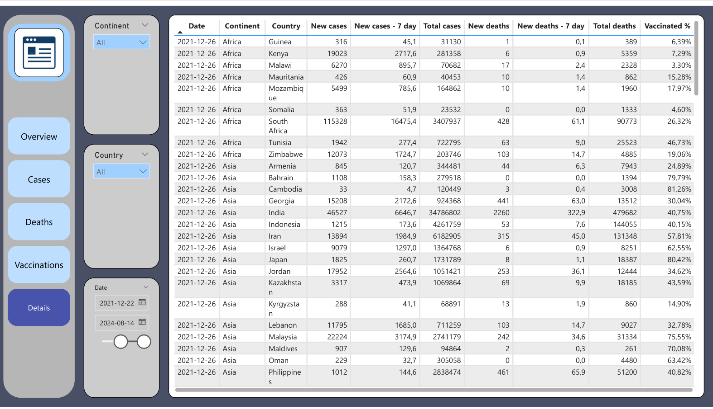

# COVID-19 global analysis dashboard

## Project overview
This project is an analytical dashboard built in Power BI using global COVID-19 data from Our World in Data OWID. The goal was to complete an end-to-end workflow - data acquisition, cleaning and feature engineering in Python, additional preparation in Power Query, data modeling, DAX measures and interactive visualizations in Power BI.
This is my first multi-page Power BI report created as a complete project.

## Data source
The dataset was downloaded from Our World in Data (OWID):

- OWID COVID-19 dataset (CSV): https://raw.githubusercontent.com/owid/covid-19-data/master/public/data/owid-covid-data.csv

## Data preparation in Python
Initial processing was performed in Google Colab using Python.

### Main steps
- Selected relevant columns:
  - iso_code, continent, location, date
  - new_cases, new_deaths, total_cases, total_deaths
  - people_vaccinated, people_fully_vaccinated, population
- Filtered out non-country aggregates:
  - removed rows where iso_code starts with OWID
  - removed rows with missing continent
- Converted date to datetime and created year_month
- Filled missing values with 0
- Calculated rolling 7 day averages:
  - new_cases_7day
  - new_deaths_7day
- Calculated vaccination percentage:
  - Percent_Vaccinated = people_fully_vaccinated / population (clipped to max 1.0)
- Exported the final dataset:
  - covid_final.csv

## Power query and data model - Power BI

After importing `covid_final.csv` into Power BI:

- Additional formatting and transformations were applied in Power Query
- A dedicated date dimension was created:

  - `DateTable = CALENDAR(MIN(covid_final[date]), MAX(covid_final[date]))`

- Relationships were created between the fact table and the date table
- Report-wide slicers were implemented in the dashboard

## Report pages and visuals

The report contains five pages:

### Overview
- Key KPIs - total cases, total deaths, new cases (7-day avg), new deaths (7-day avg), fully vaccinated % in 2024
- Global trend of new cases (7-day avg)
- Top countries by new cases (7-day avg)

### Cases
- Cases KPIs
- Weekly heatmap for seasonality by weekday and month
- Cases per 100k

### Deaths
- Deaths KPIs (latest snapshot)
- CFR (Case Fatality Rate) analysis
- Distribution of countries by CFR bins

### Vaccinations
- Vaccination KPIs
- Comparison of vaccination coverage across countries

### Details
- A detailed interactive table with key metrics per country and date
- Used for validation and deeper inspection

## Key DAX concepts used

- Snapshot measures - latest available values
- Trend measures over time - date-aware calculations
- Country-level measures vs aggregated measures
- Weighted calculations - vaccination percentage weighted by population
- Per-capita normalization - cases per 100k
- CFR calculations and binning

## Key findings

- The time series reveals multiple pandemic waves
- Per-100k metrics enable fair comparison across countries with different population sizes
- Vaccination coverage varies significantly across countries and regions
- Most countries fall into low CFR ranges, but outliers exist
- Some countries show gaps in reporting toward the end of the dataset, which impacts "latest snapshot" calculations and requires careful handling

## Conclusions

This project demonstrates a complete BI workflow:

- Data acquisition from an open public source
- Data cleaning and feature engineering in Python
- Additional transformations in Power Query
- Data modeling with a date dimension and relationships
- DAX measures for snapshots, trends, normalization and weighted metrics
- A multi-page interactive Power BI report with consistent navigation and slicers

Building this report improved my understanding of:

- Real-world data quality challenges
- The importance of separating snapshot vs trend measures
- DAX filter context and correct aggregation logic
- Dashboard design and interactive reporting structure

## Future improvements

- Add dynamic "as of selected date" snapshots as an alternative to global latest snapshots
- Extend analysis with correlation between vaccination coverage and case intensity
- Optimize performance and measure organization - few of them were "useless" or maybe I should have prepared them more accurately....
- Add drill-through pages as an addition

---
## Author

- **Author -** [Przemysław Dyjak](https://www.linkedin.com/in/przemys%C5%82aw-dyjak-666a11356/?trk=public-profile-join-page)
